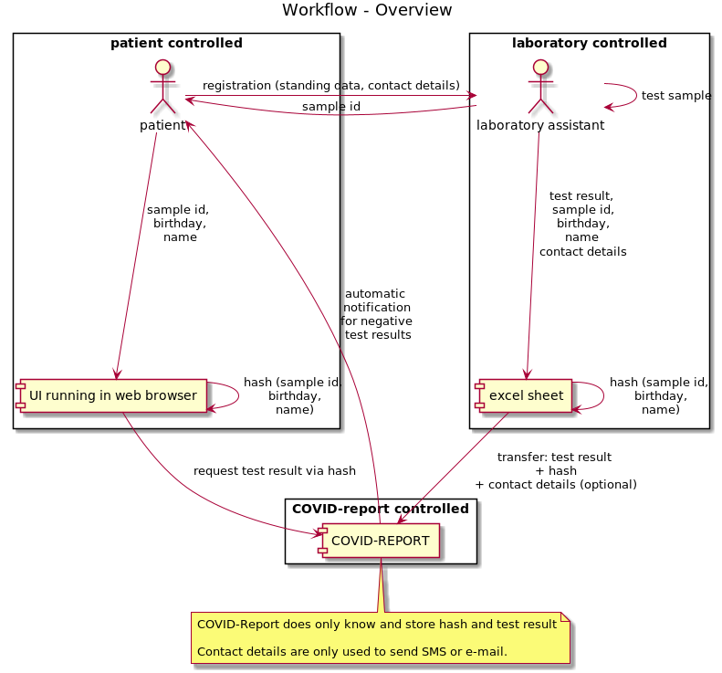

 [](https://coveralls.io/github/COVID-Report/wirvsvirus-backend-quarkus?branch=master) [](https://sonarcloud.io/dashboard?id=COVID-Report_wirvsvirus-backend-quarkus)

# COVID-Report backend

## Team 1896 - Kommunikation von Testergebnissen
Backend zum Thema Kommunikation von Testergebnissen. Hier soll der Kommunikationsfluss von Testergebnissen zurück zu den Patienten 
erleichtert und beschleunigt werden. 

## Idee
Integration eines Informations services in die bestehenden Prozesse der Test Stationen. Der Fokus liegt auf einfacher Bedienbarkeit 
für medizinisches Personal und Patienten. 
Ein besonderer Punkt ist die Lösung des Problems, dass aktuell Patienten mit negativem Testergebnis aktuell keine aktive 
Benachrichtigung erhalten. Dies führt zu erheblichen Unsicherheiten bei den Patienten.

## Umsetzung

### Schnittstellen
* REST API zum Hinterlegen von anonymisierten Testergebnissen (nicht öffentlich, für medizinische Einrichtungen)
* REST API zum Erfragen von Testergebnissen (anonyme Nutzung durch Web UI)

### Funktionen
Zusätzlich zu den oben genannten APIs soll der Service auch ermöglichen automatisiert Benachrichtigungen an die Patienten zu versenden
(sofern diese sich mit Kontaktinformationen beim Test angemeldet haben). Aktuell prototypisch implementiert sind: 
* Webseite
* EMail
* SMS

weitere Kanäle in Planung
* Telefon (via automatisiertem Anruf)

#### Workflow


* Patient meldet sich beim medizinischen Personal an (mit Stammdaten und evtl. Kontaktdaten)
* Patient erhält seine Probennummer (erstellt vom medizinischen Personal/Labor)
* Test wird vom Labor durchgeführt und rückgemeldet
* via hashing wird eine anonymisierte Id erstellt (enthält: Geburtsdatum, Name, Probennummer)
* Testergebnis wird an den Service übermittelt (anonyme Id + Ergebnis + Kontaktinformation falls vorhanden)
* Testergebnis wird unter anonymisierter Id gespeichert, falls Kontaktinformation vorhanden wird eine Nachricht gesendet
* Testergebnis ist nun via Webseite abrufbar (unter Angabe von Geburtsdatum, Name, Probennummer)


### Systemübersicht

* client für medizinisches Personal (Excel)
* backend (dieser service)
* [frontend (Website für Zugriff auf Informationen zum Testergebnis)](https://github.com/DominikGri/wirvsvirus-testergebnis-ui)

## Links
* hackathon https://wirvsvirushackathon.org/
* topics https://airtable.com/shrs71ccUVKyvLlUA/tbl6Br4W3IyPGk1jt/viw7AlEju6qFtXJqL?blocks=hide
* https://github.com/DominikGri/wirvsvirus-testergebnis-ui

## The backend project

This implementation uses [Quarkus](https://quarkus.io/)


## Running the application in dev mode

To run the application a mongodb is required.

You can run your application in dev mode that enables live coding using:
```
./mvnw quarkus:dev
```

## Packaging and running the application

The application can be packaged using `./mvnw package`.
It produces the jar file in the `/target` directory.
Be aware that it’s not an _über-jar_ as the dependencies are copied into the `target/lib` directory.

The application is now runnable using `java -jar target/backend-1.0.0-SNAPSHOT-runner.jar`.

## Creating a native executable

You can create a native executable using: `./mvnw package -Pnative`.

Or, if you don't have GraalVM installed, you can run the native executable build in a container using: `./mvnw package -Pnative -Dquarkus.native.container-build=true`.

You can then execute your native executable with: `./target/backend-1.0.0-SNAPSHOT-runner`

If you want to learn more about building native executables, please consult https://quarkus.io/guides/building-native-image-guide.

## Endpoints

See [restclient/restclient.rest](restclient/restclient.rest)