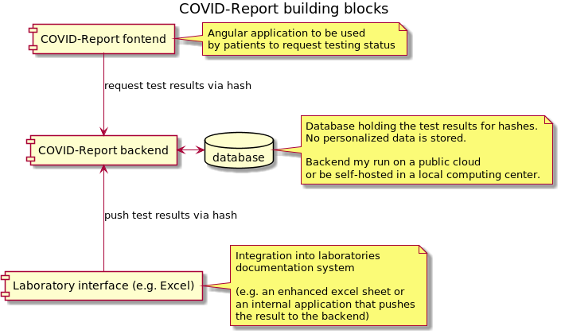
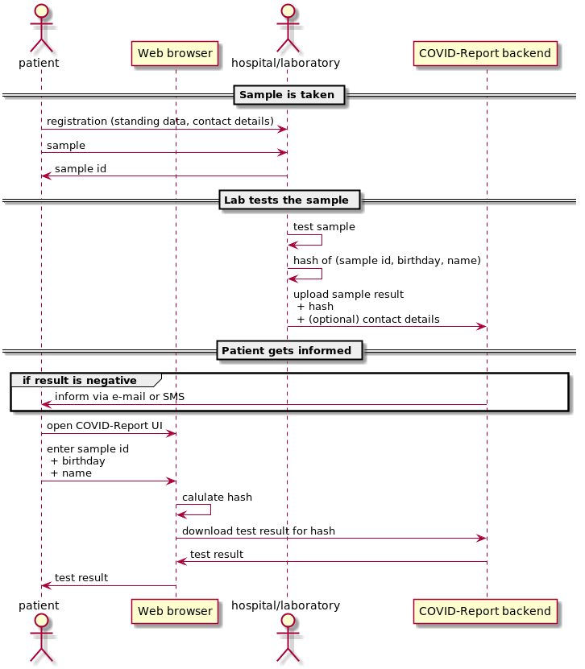

  

# COVID-Report: Lightweight automated reporting of test results

COVID-Report is a simple system to automate the notification of medical test results.

It was started in the [#WIRVSVIRUS](https://wirvsvirus.org/) hackathon of the german goverment.
There is a [(german) description of hackathon idea on devpost.com](https://devpost.com/software/1986-kommunikation-von-testergebnissen).

The goal was to provide a secure, easy to use and easy to integrate service to report negative test results to patients.

Positive test results should still be delivered by the health personal since the patient probably has questions that should be answered.

## The COVID-Report system

The COVID-Report system consists of three components

* an Angular frontend [wirvsvirus-testergebnis-ui](https://github.com/COVID-Report/wirvsvirus-testergebnis-ui)
   * it provides an UI for the patient to request the test status and result
* an Java backend [wirvsvirus-backend-quarkus](https://github.com/COVID-Report/wirvsvirus-backend-quarkus)
   * provides REST interfaces for UI and laboratory integration
* an example laboratory integration via excel templates [WirVsVirus-1896-Excel-Template](https://github.com/COVID-Report/WirVsVirus-1896-Excel-Template)
   * This is mainly to show how an integration can work. 
   Laboratories probably want to integrate the solution in their already existing systems.
   
## Workflow

* When a patient is tested, a sample is taken e.g. at the doctor or in a hospital. 
   * the patient leaves her name, birthday, contact details and received a sample id

* After the sample has been tested to result is uploaded to the COVID-Report backend.
   * The result is uploaded together with a hash code which has been generated from the sample id, 
   the name and birthday of the patient.
   * Optional some contact details like e-mail address or mobile number are sent to the backend.

* The backend stores the hash and test result pair in it's database.
* When the test result is negative and contact details are passed,
the backend informs the patient about the test result.
** The contact details are only used for notification and are not stored in the backend.
* The patient can use the COVID-Report frontend UI to check the test status.
   * She enters the sample id, name and birthday on the website which calculates the hash and requests the backend 
for the test result associated with that hash.

### Communication flow

## Security

The system is designed with data protection in mind. The backend stores the test results together with a hash.
The hash is created from multiple values - in the default setup from the patients name and birthday 
and the id of the sample taken. 

Only if these three values are known, one can request the result from the backend.
Pushing test results to the backend is also protected by username/password credentials.

## Setting up the system

COVID-Report can be run on a public cloud (we used Microsoft Azure for testing) as well as 
on a local server.

There is a [docker-compose file](https://github.com/COVID-Report/wirvsvirus-compose) to run an environment using docker.
 
### Requirements

* Backend
  * System requirements: Java SE 11, 1 GB RAM 
     * our test system runs in Azure App Service Plan F1
  * a [mongodb](https://www.mongodb.com/) to persist the data (mandatory)
  * a [sendgrid account](https://app.sendgrid.com/) to send e-mails (optional)
  * a [sms4 account](https://www.sms4.de) to send SMS (optional)
  * see [README-Configuration.md](README-Configuration.md) for configuration parameters
  
* Frontend
  * a web server hosting the application file (e.g. nginx)
     * our test system uses an Azure Storage with "Static website" feature enabled
     

### Links

* [wirvsvirus-testergebnis-ui](https://github.com/COVID-Report/wirvsvirus-testergebnis-ui)
* [wirvsvirus-backend-quarkus](https://github.com/COVID-Report/wirvsvirus-backend-quarkus)
    * [Backend readme](https://github.com/COVID-Report/wirvsvirus-backend-quarkus/README-Backend.md)
    * [Backend API description Swagger UI](https://joemat-crtest.azurewebsites.net/swagger-ui/)
    * API examples for IntelliJ REST client: [restclient/restclient.rest](restclient/restclient.rest)
* [WirVsVirus-1896-Excel-Template](https://github.com/COVID-Report/WirVsVirus-1896-Excel-Template)

#### Test environment 

* [Frontend UI](https://covidreportuitest.z6.web.core.windows.net/index.html)
* [Backend API description Swagger UI](https://joemat-crtest.azurewebsites.net/swagger-ui/)

First request may take multiple seconds since app is started on request.

Test users

|Sample Id | Name |    Birthday | Test result |
|----------|------|-------------|-------------|
|    123   | John |  01.02.1980 | negative    |
|    123   |  Doe |  01.02.1980 | positive    |
